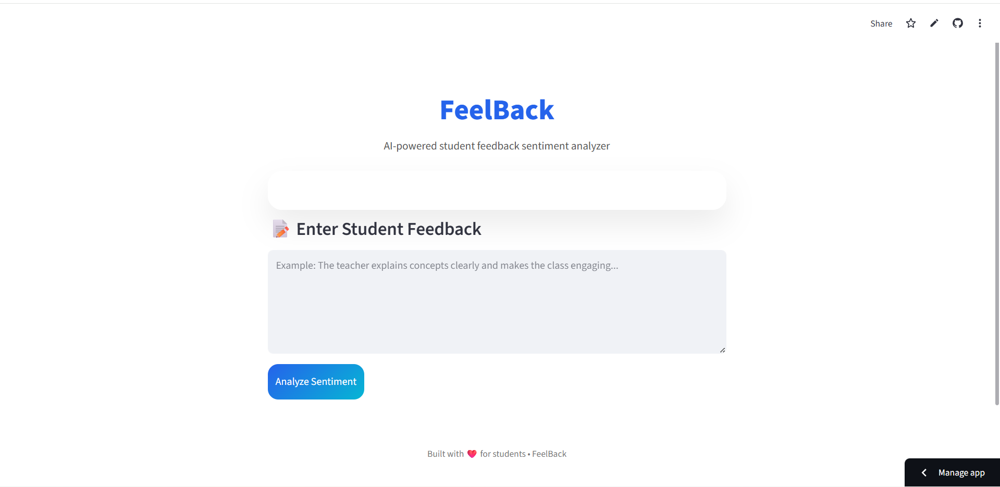
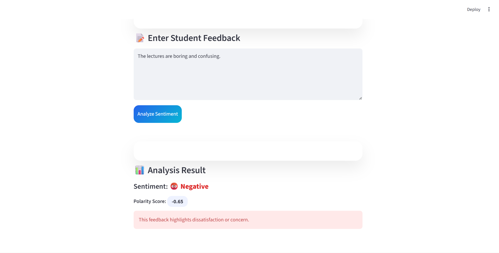

# 🎓 FeelBack  
**Student Feedback Sentiment Analyzer using AI**

FeelBack is a simple, beginner-friendly AI web application that analyzes student feedback and identifies whether the sentiment is **Positive**, **Neutral**, or **Negative**.  
It is built using **Python**, **Streamlit**, and **TextBlob**, focusing on clarity, usability, and real-world relevance.

---

## 🌐 Live Demo

👉 **Try the app here:**  
https://feelback-jjuna5kdj5zoetpck4vuwk.streamlit.app/

---

## ❓ Problem Statement

Educational institutions receive large amounts of student feedback in text form.  
Manually reading and understanding the overall sentiment from this feedback is:

- Time-consuming  
- Error-prone  
- Difficult to summarize  

There is a need for a **simple and automated way** to quickly understand how students feel.

---

## 💡 Solution Overview

FeelBack solves this problem by using **Natural Language Processing (NLP)** to:

- Analyze written student feedback  
- Calculate sentiment polarity  
- Classify feedback as Positive, Neutral, or Negative  
- Present results in a clean, user-friendly web interface  

The goal is to make sentiment analysis **accessible even for beginners**.

---

## ✨ Key Features

- 📝 Simple text input for student feedback  
- 🤖 AI-based sentiment analysis using TextBlob  
- 😊 Emoji-based sentiment display  
- 📊 Polarity score for transparency  
- ⚠️ Input validation to prevent errors  
- 🎨 Clean and attractive Streamlit UI  
- 🚀 No paid APIs or services  

---

## 🛠 Tech Stack

- **Python** – Core programming language  
- **Streamlit** – Web application framework  
- **TextBlob** – Sentiment analysis library  
- **HTML/CSS (via Streamlit)** – UI styling  

All tools used are **free and open-source**.

---

## ⚙️ How It Works

1. User enters student feedback text  
2. Clicks the **Analyze Sentiment** button  
3. Text is passed to TextBlob for analysis  
4. Polarity score is calculated  
5. Sentiment is classified:
   - Positive 😊  
   - Neutral 😐  
   - Negative 😡  
6. Result is displayed on screen with explanation  

---

## 🚀 Installation & Setup (Run Locally)

### 1️⃣ Clone the Repository
```bash
git clone https://github.com/your-username/FeelBack.git
cd FeelBack
```

2️⃣ Create Virtual Environment (Optional but Recommended)
```
python -m venv venv
source venv/bin/activate   # On Windows: venv\Scripts\activate
```

3️⃣ Install Dependencies
```
pip install -r requirements.txt
```

4️⃣ Download TextBlob Corpora (First Time Only)
```
python -m textblob.download_corpora
```

5️⃣ Run the App
```
streamlit run app.py
```

📁 Project Structure
```
FEELBACK/
│
├── __pycache__/        # Python cache files (auto-generated)
├── .git/               # Git version control directory
├── images              # To store the images
├── venv/               # Virtual environment (not pushed to GitHub)
│
├── .gitignore          # Files and folders ignored by Git
├── app.py              # Streamlit UI and application logic
├── logo.png            # Application logo
├── requirements.txt    # Project dependencies
├── sentiment.py        # TextBlob sentiment analysis logic
```

### 🖼 Screenshots

> 📌 Add screenshots here once available

### Home Screen


### Sentiment Analysis Result


## 🔮 Future Enhancements

* Sentiment confidence indicator (Low / Medium / High)
* Feedback history using session state
* Downloadable sentiment report
* Batch feedback analysis
* Support for multiple languages

## 👥 Who Can Use This Project?

- 🎓 Students learning Python or AI

- 👨‍🏫 Educators analyzing feedback quickly

- 🧑‍💻 Beginners building their first AI project

- 💼 Candidates showcasing projects in interviews

## 📌 Final Note

FeelBack is designed to be simple, practical, and educational.
It demonstrates how AI can solve real problems without complex tools or paid services.

Feel free to ⭐ the repo, fork it, and build on top of it!
<p align="center">
  <strong>Made with ❤️ using Python & Streamlit</strong>
</p>
